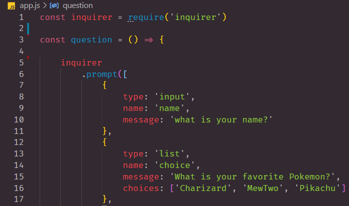

# node103

## NPM Packages and Node Modules 

> Node Package Manager (NPM) installation instructions. These package are basically apps for your development needs.  We also review what a gitignore file that helps us manage all of our node packages.

## How do you install NPM?

> In order to install and use a variety of NPM packages follow the steps below in your terminal. 

***Figure One***

***npm i Chalk***

> Source Reference
- [npm chalk](https://www.npmjs.com/package/chalk)
- [github chalk-animation](https://github.com/bokub/chalk-animation)

## npm i inquirer

> Here is an example of how "Inquirer" works.

> Type in terminal npm i inquirer

***npm i inquirer***

***Inquirer Example***

> Source Reference
- [npm inquirer](https://www.npmjs.com/package/inquirer)

## LINKS

- [GitHub Repo Link](https://github.com/nicholasd-uci/node103)
- [Nicholas Dallas's GitHub](https://github.com/nicholasd-uci)

- - -
© 2020 NPRD, Nicholas Paul Ruiz Dallas